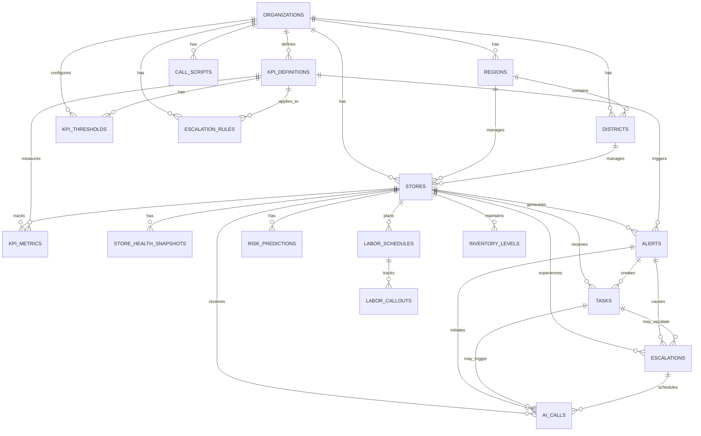

# Store Health AI - Visual Overview

## Table of Contents
1. [System Architecture](#system-architecture)
2. [Dashboard UI Mockups](#dashboard-ui-mockups)
3. [Data Flow Diagram](#data-flow-diagram)
4. [Database ERD](#database-erd)
5. [Escalation Flow](#escalation-flow)
6. [Daily Workflow](#daily-workflow)

---

## System Architecture

```
┌─────────────────────────────────────────────────────────────────────────┐
│                         STORE HEALTH AI SYSTEM                          │
└─────────────────────────────────────────────────────────────────────────┘

┌──────────────────────┐
│   DATA SOURCES       │
├──────────────────────┤
│ • POS System         │──┐
│ • People Counter     │  │
│ • Inventory System   │  │
│ • Labor Management   │  │
│ • HR System          │  │
└──────────────────────┘  │
                          │
                          ▼
         ┌────────────────────────────────────┐
         │      DATA INGESTION LAYER          │
         ├────────────────────────────────────┤
         │  • ETL Jobs (Scheduled)            │
         │  • Data Validation                 │
         │  • KPI Calculator Service          │
         └────────────────────────────────────┘
                          │
                          ▼
         ┌────────────────────────────────────┐
         │         DATABASE LAYER             │
         ├────────────────────────────────────┤
         │  PostgreSQL (20 Tables)            │
         │  • KPI Metrics (Time-series)       │
         │  • Stores & Organization           │
         │  • Thresholds & Rules              │
         │  • Alerts, Tasks, Escalations      │
         └────────────────────────────────────┘
                          │
                          ▼
         ┌────────────────────────────────────┐
         │      BUSINESS LOGIC LAYER          │
         ├────────────────────────────────────┤
         │  ✅ KPI Calculator Service         │
         │  ✅ Threshold Checker Service      │
         │  ✅ Alert Manager Service          │
         │  ✅ Escalation Engine Service      │
         │  🔜 Voice Call Manager (Option 3)  │
         └────────────────────────────────────┘
                          │
                          ▼
         ┌────────────────────────────────────┐
         │         API LAYER (Option 2)       │
         ├────────────────────────────────────┤
         │  Express REST API                  │
         │  • /api/stores/:id/health          │
         │  • /api/stores/:id/kpis            │
         │  • /api/alerts                     │
         │  • /api/tasks                      │
         │  • /api/dashboard                  │
         └────────────────────────────────────┘
                          │
          ┌───────────────┼───────────────┐
          │               │               │
          ▼               ▼               ▼
┌──────────────┐  ┌──────────────┐  ┌──────────────┐
│  DASHBOARD   │  │ AI VOICE     │  │  MOBILE      │
│  UI (Opt 4)  │  │ CALLS (Opt3) │  │  APP         │
├──────────────┤  ├──────────────┤  ├──────────────┤
│ React/Vue    │  │ Twilio/Vapi  │  │ React Native │
│ • Overview   │  │ • Level 3    │  │ • Alerts     │
│ • Alerts     │  │ • Scripts    │  │ • Tasks      │
│ • KPI Charts │  │ • Responses  │  │ • Status     │
│ • Tasks      │  └──────────────┘  └──────────────┘
└──────────────┘

         ┌────────────────────────────────────┐
         │      SCHEDULED JOBS (Cron)         │
         ├────────────────────────────────────┤
         │  Daily (1 AM):                     │
         │    • Check Store Health            │
         │    • Generate Alerts               │
         │                                    │
         │  Hourly:                           │
         │    • Monitor Escalations           │
         │    • Check SLAs                    │
         │                                    │
         │  Every 15 min:                     │
         │    • Trigger AI Calls              │
         │    • Update Health Scores          │
         └────────────────────────────────────┘

┌──────────────────────────────────────────────────────────────────────┐
│                    NOTIFICATION CHANNELS                             │
├──────────────────────────────────────────────────────────────────────┤
│  📧 Email    │  📱 SMS    │  🔔 Push    │  📞 AI Voice Calls      │
└──────────────────────────────────────────────────────────────────────┘
```

---

## Dashboard UI Mockups

### 1. Main Dashboard - Store Health Overview

```
╔══════════════════════════════════════════════════════════════════════════╗
║  🏪 Store Health AI Dashboard                     👤 Admin    🔔 3    ⚙  ║
╠══════════════════════════════════════════════════════════════════════════╣
║                                                                          ║
║  📅 February 2, 2026                    🔄 Last updated: 2 mins ago     ║
║                                                                          ║
║  ┌────────────────────────────────────────────────────────────────────┐ ║
║  │                     SYSTEM HEALTH SUMMARY                          │ ║
║  ├────────────────────────────────────────────────────────────────────┤ ║
║  │                                                                    │ ║
║  │   🟢 Healthy Stores           12  ██████████████████░░░░  60%     │ ║
║  │   🟨 Stores Needing Attention  5  ███████░░░░░░░░░░░░░░░  25%     │ ║
║  │   🔴 Critical Stores            3  ████░░░░░░░░░░░░░░░░░░  15%     │ ║
║  │                                                                    │ ║
║  │   Average Health Score: 78.5/100                                  │ ║
║  │   ⚠️ Stores Requiring Action: 8                                   │ ║
║  │                                                                    │ ║
║  └────────────────────────────────────────────────────────────────────┘ ║
║                                                                          ║
║  ┌─────────────────────────────────────────────────────────────────┐   ║
║  │  🔴 CRITICAL ALERTS (3)                               View All → │   ║
║  ├─────────────────────────────────────────────────────────────────┤   ║
║  │  🔴 DT-001 Manhattan 42nd St                                    │   ║
║  │     Labor Coverage: 85% (RED) - Understaffed                    │   ║
║  │     Level 3 Escalation • AI Call Scheduled                      │   ║
║  │     Manager: Alice Martinez • Due: 6 hours                      │   ║
║  │     ┌──────────────┐  ┌──────────────┐                          │   ║
║  │     │ Acknowledge  │  │ View Details │                          │   ║
║  │     └──────────────┘  └──────────────┘                          │   ║
║  │                                                                  │   ║
║  │  🔴 DT-005 Bronx Grand Concourse                                │   ║
║  │     Sales: -12.5% vs 4W Avg (RED) - Critical variance          │   ║
║  │     Level 2 • Task assigned to manager                          │   ║
║  │     Manager: David Park • Due: 18 hours                         │   ║
║  │                                                                  │   ║
║  │  🔴 DT-012 Staten Island Mall                                   │   ║
║  │     Inventory OOS: 8.5% (RED) - Top SKUs unavailable           │   ║
║  │     Level 2 • Action required                                   │   ║
║  │     Manager: Maria Santos • Due: 2 days                         │   ║
║  └─────────────────────────────────────────────────────────────────┘   ║
║                                                                          ║
║  ┌───────────────────────────┐  ┌───────────────────────────────────┐  ║
║  │  📊 KPI TRENDS (7 Days)   │  │  🎯 TOP ISSUES                   │  ║
║  ├───────────────────────────┤  ├───────────────────────────────────┤  ║
║  │                           │  │                                   │  ║
║  │  Sales      ████░░ -3.2%  │  │  Labor Coverage      8 stores    │  ║
║  │  Traffic    █████░ -1.8%  │  │  Sales Performance   5 stores    │  ║
║  │  Convert    ██████  +2.1% │  │  Inventory OOS       3 stores    │  ║
║  │  Labor      ███░░░ -5.5%  │  │  Traffic             2 stores    │  ║
║  │                           │  │                                   │  ║
║  └───────────────────────────┘  └───────────────────────────────────┘  ║
║                                                                          ║
╚══════════════════════════════════════════════════════════════════════════╝
```

### 2. Individual Store Detail View

```
╔══════════════════════════════════════════════════════════════════════════╗
║  ← Back to Dashboard                                                     ║
╠══════════════════════════════════════════════════════════════════════════╣
║                                                                          ║
║  🏪 DT-001: Dollar Tree - Manhattan 42nd St                             ║
║  📍 123 West 42nd Street, New York, NY 10036                            ║
║  👤 Manager: Alice Martinez | 📞 +1-555-0202                            ║
║                                                                          ║
║  ┌────────────────────────────────────────────────────────────────────┐ ║
║  │  STORE HEALTH STATUS                                               │ ║
║  ├────────────────────────────────────────────────────────────────────┤ ║
║  │                                                                    │ ║
║  │         🔴 RED - ACTION REQUIRED                                   │ ║
║  │                                                                    │ ║
║  │         Health Score: 68.5/100                                     │ ║
║  │         Escalation Level: 2                                        │ ║
║  │         Last Updated: 15 minutes ago                               │ ║
║  │                                                                    │ ║
║  │         KPI Status:                                                │ ║
║  │         🟢 Green: 2  🟨 Yellow: 1  🔴 Red: 1                       │ ║
║  │                                                                    │ ║
║  └────────────────────────────────────────────────────────────────────┘ ║
║                                                                          ║
║  ┌────────────────────────────────────────────────────────────────────┐ ║
║  │  KPI PERFORMANCE (Today vs Rolling 4 Weeks)                        │ ║
║  ├────────────────────────────────────────────────────────────────────┤ ║
║  │                                                                    │ ║
║  │  💰 Sales Performance                                       🟢 GREEN │ ║
║  │     Current: $13,500  |  4W Avg: $12,000  |  Variance: +12.5%    │ ║
║  │     ████████████████████████████████░░░░░░░░░░░░                  │ ║
║  │                                                                    │ ║
║  │  👥 Store Traffic                                         🟨 YELLOW │ ║
║  │     Current: 380  |  4W Avg: 432  |  Variance: -12.0%            │ ║
║  │     ██████████████████████░░░░░░░░░░░░░░░░░░░░                    │ ║
║  │                                                                    │ ║
║  │  🎯 Conversion Rate                                        🟢 GREEN │ ║
║  │     Current: 35.5%  |  4W Avg: 33.8%  |  Variance: +1.7 pts      │ ║
║  │     ████████████████████████████████████░░░░░░░░                  │ ║
║  │                                                                    │ ║
║  │  👷 Labor Coverage Ratio                                    🔴 RED  │ ║
║  │     Current: 85%  |  Target: 95%  |  Variance: -10%              │ ║
║  │     █████████████████░░░░░░░░░░░░░░░░░░░░░░░░                    │ ║
║  │     ⚠️ 2 unfilled call-outs during peak hours                     │ ║
║  │                                                                    │ ║
║  └────────────────────────────────────────────────────────────────────┘ ║
║                                                                          ║
║  ┌────────────────────────────────────────────────────────────────────┐ ║
║  │  📋 ACTIVE TASKS (2)                                               │ ║
║  ├────────────────────────────────────────────────────────────────────┤ ║
║  │                                                                    │ ║
║  │  ✓ Task #1: Review Labor Coverage - RED                 Priority 1 │ ║
║  │    Due: Today, 11:59 PM (in 6 hours)                              │ ║
║  │    Status: Pending                                                │ ║
║  │    Actions:                                                       │ ║
║  │      1. Fill open shifts immediately                              │ ║
║  │      2. Contact backup staff for coverage                         │ ║
║  │      3. Review schedule for next 48 hours                         │ ║
║  │    ┌──────────┐  ┌──────────┐  ┌──────────┐                      │ ║
║  │    │ Complete │  │ Reassign │  │ Escalate │                      │ ║
║  │    └──────────┘  └──────────┘  └──────────┘                      │ ║
║  │                                                                    │ ║
║  │  ⚠ Task #2: Review Traffic Decline - YELLOW         Priority 3    │ ║
║  │    Due: Tomorrow, 5:00 PM                                         │ ║
║  │    Status: In Progress                                            │ ║
║  │                                                                    │ ║
║  └────────────────────────────────────────────────────────────────────┘ ║
║                                                                          ║
║  ┌────────────────────────────────────────────────────────────────────┐ ║
║  │  📞 AI CALL HISTORY (1)                                            │ ║
║  ├────────────────────────────────────────────────────────────────────┤ ║
║  │                                                                    │ ║
║  │  🔴 RED Alert Call - Jan 28, 2026 9:15 AM                         │ ║
║  │     Duration: 2m 34s  |  Response: Manager will handle           │ ║
║  │     Topic: Sales Performance -8.5%                                │ ║
║  │     [ View Transcript ] [ Listen to Recording ]                   │ ║
║  │                                                                    │ ║
║  └────────────────────────────────────────────────────────────────────┘ ║
║                                                                          ║
╚══════════════════════════════════════════════════════════════════════════╝
```

### 3. Alert Inbox

```
╔══════════════════════════════════════════════════════════════════════════╗
║  🔔 Alert Inbox                           Filter: [All] [Red] [Yellow]   ║
╠══════════════════════════════════════════════════════════════════════════╣
║                                                                          ║
║  [ Search stores, KPIs, managers... ]                     Sort: Latest  ║
║                                                                          ║
║  ┌────────────────────────────────────────────────────────────────────┐ ║
║  │  🔴 Alert #147 - Level 3 Escalation           NEW     2 hours ago  │ ║
║  │  DT-001 Manhattan 42nd St • Labor Coverage                         │ ║
║  │  85% coverage (RED) - 2 unfilled call-outs during peak hours       │ ║
║  │  Assigned: Alice Martinez • AI Call Scheduled: 3:00 PM             │ ║
║  │  ┌────────────┐  ┌──────────┐  ┌────────────┐                     │ ║
║  │  │ View Store │  │ Schedule │  │ Escalate   │                     │ ║
║  │  └────────────┘  └──────────┘  └────────────┘                     │ ║
║  └────────────────────────────────────────────────────────────────────┘ ║
║                                                                          ║
║  ┌────────────────────────────────────────────────────────────────────┐ ║
║  │  🔴 Alert #146 - Level 2                      ✓ ACK   5 hours ago  │ ║
║  │  DT-005 Bronx Grand Concourse • Sales Performance                  │ ║
║  │  -12.5% vs 4W avg (RED) - Critical variance                        │ ║
║  │  Acknowledged by: David Park (3 hours ago)                         │ ║
║  │  Task due: Tomorrow 5 PM                                           │ ║
║  └────────────────────────────────────────────────────────────────────┘ ║
║                                                                          ║
║  ┌────────────────────────────────────────────────────────────────────┐ ║
║  │  🟨 Alert #145 - Level 1                               8 hours ago  │ ║
║  │  DT-012 Staten Island Mall • Conversion Rate                       │ ║
║  │  -2.1% variance (YELLOW) - Slight decline in conversion            │ ║
║  │  Assigned: Maria Santos • Task created                             │ ║
║  │  ┌────────────┐  ┌──────────┐                                     │ ║
║  │  │ Acknowledge│  │ Dismiss  │                                     │ ║
║  │  └────────────┘  └──────────┘                                     │ ║
║  └────────────────────────────────────────────────────────────────────┘ ║
║                                                                          ║
║  ┌────────────────────────────────────────────────────────────────────┐ ║
║  │  🟨 Alert #144 - Level 1                             Yesterday      │ ║
║  │  DT-018 Queens Center • Inventory OOS Rate                         │ ║
║  │  4.5% OOS (YELLOW) - Top SKUs running low                          │ ║
║  │  Resolved by: Robert Lee • Restocked today                         │ ║
║  └────────────────────────────────────────────────────────────────────┘ ║
║                                                                          ║
║                          [ Load More Alerts ]                            ║
║                                                                          ║
╚══════════════════════════════════════════════════════════════════════════╝
```

---

## Data Flow Diagram

```
┌─────────────────────────────────────────────────────────────────────────┐
│                          DATA FLOW OVERVIEW                             │
└─────────────────────────────────────────────────────────────────────────┘


DAY 1: METRIC COLLECTION & BASELINE CALCULATION
═════════════════════════════════════════════════

  [External Systems]
        │
        │ Raw Data
        ▼
  ┌──────────────┐
  │ KPI          │──── calculateAndStoreKpi()
  │ Calculator   │
  └──────────────┘
        │
        │ Calculated Metrics
        ▼
  ┌──────────────────────────────┐
  │  kpi_metrics table           │
  │  • value                     │
  │  • comparison_value (4W avg) │
  │  • variance_pct              │
  │  • status (green/yellow/red) │
  └──────────────────────────────┘


DAY 1: HEALTH ASSESSMENT
══════════════════════════

  [kpi_metrics]
        │
        │ Today's KPIs
        ▼
  ┌──────────────┐
  │ Threshold    │──── checkStoreHealth()
  │ Checker      │
  └──────────────┘
        │
        │ Health Snapshot
        ▼
  ┌──────────────────────────────┐
  │  store_health_snapshots      │
  │  • overall_status (R/Y/G)    │
  │  • health_score (0-100)      │
  │  • escalation_level (0-4)    │
  │  • action_required (bool)    │
  └──────────────────────────────┘


DAY 1: ALERT GENERATION
═══════════════════════

  [kpi_metrics with status='red' or 'yellow']
        │
        │ Threshold Violations
        ▼
  ┌──────────────┐
  │ Alert        │──── processStoreKpis()
  │ Manager      │
  └──────────────┘
        │
        ├─────────────┬─────────────┐
        │             │             │
        ▼             ▼             ▼
   ┌────────┐   ┌─────────┐   ┌────────────┐
   │ alerts │   │  tasks  │   │ Email/SMS  │
   │ table  │   │  table  │   │ Notification│
   └────────┘   └─────────┘   └────────────┘
        │
        │ Alert Created
        │ Level 1 (Yellow) or Level 2 (Red)
        ▼


DAY 2: ESCALATION MONITORING (24 hours later)
═══════════════════════════════════════════════

  [alerts with status='active' and age > SLA]
        │
        │ Overdue Alerts
        ▼
  ┌──────────────┐
  │ Escalation   │──── monitorAndEscalate()
  │ Engine       │
  └──────────────┘
        │
        ├─────────────┬─────────────┐
        │             │             │
        ▼             ▼             ▼
   ┌────────────┐ ┌─────────┐ ┌──────────────┐
   │escalations │ │ tasks   │ │  ai_calls    │
   │  Level 2→3 │ │ (urgent)│ │  (scheduled) │
   └────────────┘ └─────────┘ └──────────────┘
        │
        │ AI Voice Call Scheduled
        ▼
  ┌──────────────┐
  │ Voice Call   │──── scheduleCall()
  │ Manager      │
  └──────────────┘
        │
        │ Call Twilio/Vapi API
        ▼
  [Store Manager receives AI call]


DAY 3: REGIONAL ESCALATION (48 hours later)
═══════════════════════════════════════════

  [escalations with status='pending' and age > 48hrs]
        │
        │ Persistent Red
        ▼
  ┌──────────────┐
  │ Escalation   │──── escalateToRegional()
  │ Engine       │
  └──────────────┘
        │
        │ Level 3→4
        ▼
  ┌──────────────────────────────┐
  │  Notify District Manager     │
  │  Create high-priority task   │
  │  Send SMS + Email alert      │
  └──────────────────────────────┘


RESOLUTION FLOW
═══════════════

  [Store Manager takes action]
        │
        ├──────────────────┬────────────────┐
        │                  │                │
        ▼                  ▼                ▼
  ┌──────────┐      ┌──────────┐    ┌──────────┐
  │ Complete │      │ Resolve  │    │ Update   │
  │   Task   │      │  Alert   │    │ KPI Data │
  └──────────┘      └──────────┘    └──────────┘
        │                  │                │
        └──────────────────┴────────────────┘
                     │
                     ▼
          ┌──────────────────────┐
          │ Re-check Health      │
          │ Status changes to    │
          │ Green if resolved    │
          └──────────────────────┘
```

---

## Database ERD



---

## Escalation Flow

```
┌─────────────────────────────────────────────────────────────────────────┐
│                      5-LEVEL ESCALATION MODEL                           │
└─────────────────────────────────────────────────────────────────────────┘


LEVEL 0: 🟢 GREEN - ALL HEALTHY
═══════════════════════════════════

  All KPIs Green
       │
       ▼
  ┌──────────────┐
  │   Silent     │
  │  Monitoring  │
  └──────────────┘
       │
       ▼
  No alerts, no calls, no tasks


LEVEL 1: 🟨 YELLOW - ATTENTION NEEDED
═════════════════════════════════════

  Any KPI Yellow OR Predicted Risk ≥ 65%
       │
       ▼
  ┌──────────────────┐
  │  Create Task     │
  │  Assign to SM    │
  │  Deadline: EOD   │
  └──────────────────┘
       │
       ▼
  No call, just task notification


LEVEL 2: 🟥 RED - ACTION REQUIRED
═════════════════════════════════

  Any KPI Red OR Multiple Yellow in same domain
       │
       ▼
  ┌──────────────────────────────┐
  │  Create Task (Mandatory)     │
  │  Send Alert (Push/SMS)       │
  │  Require Acknowledgment      │
  │  SLA Deadline: 24 hours      │
  └──────────────────────────────┘
       │
       ├─── Acknowledged? ──→ Continue monitoring
       │
       └─── Not Acknowledged within 24hrs
               │
               ▼


LEVEL 3: 🔴 PERSISTENT RED - AI CALL
════════════════════════════════════

  Red persists > 24 hours OR Predicted Red ≥ 80%
       │
       ▼
  ┌──────────────────────────────┐
  │  Place AI Voice Call         │
  │  Use RED call script         │
  │  Log transcript & response   │
  │  Create urgent task          │
  └──────────────────────────────┘
       │
       ├─── Manager says "YES" ──→ Provide assistance, close escalation
       │
       ├─── Manager says "LATER" ──→ Set follow-up, continue monitoring
       │
       └─── No answer / persists 48hrs
               │
               ▼


LEVEL 4: 🚨 REGIONAL ESCALATION
════════════════════════════════

  Red persists > 48 hours OR Revenue risk threshold exceeded
       │
       ▼
  ┌──────────────────────────────┐
  │  Escalate to District Mgr    │
  │  Notify Regional Ops         │
  │  Create priority task        │
  │  Send alerts to leadership   │
  │  Provide root cause report   │
  └──────────────────────────────┘
       │
       ▼
  District/Regional Manager intervention required


RESOLUTION & DE-ESCALATION
═══════════════════════════

  At any level, if issue resolved:
       │
       ▼
  ┌──────────────────────────────┐
  │  Complete tasks              │
  │  Resolve alerts              │
  │  Update KPI status to green  │
  │  Close escalation            │
  │  Return to Level 0           │
  └──────────────────────────────┘
```

---

## Daily Workflow

```
┌─────────────────────────────────────────────────────────────────────────┐
│                      TYPICAL DAY IN THE LIFE                            │
└─────────────────────────────────────────────────────────────────────────┘


12:00 AM - END OF DAY
─────────────────────
  ▼
  All stores close, final transactions recorded


1:00 AM - DATA INGESTION
─────────────────────────
  [Nightly ETL Job Runs]
       │
       ├──→ Pull data from POS systems
       ├──→ Pull traffic data from people counters
       ├──→ Pull inventory levels
       └──→ Pull labor schedule data
            │
            ▼
  ┌──────────────────────────┐
  │  KPI Calculator Service  │
  │  calculates today's KPIs │
  └──────────────────────────┘
       │
       ▼
  • Sales Performance: $13,500 (+12.5% vs 4W avg) → GREEN
  • Traffic: 380 (-12% vs 4W avg) → YELLOW
  • Conversion: 35.5% (+1.7pts vs 4W avg) → GREEN
  • Labor Coverage: 85% (-10% vs target) → RED
  • Inventory OOS: 2.1% (below 3%) → GREEN


1:30 AM - HEALTH CHECK
──────────────────────
  [Health Check Job Runs]
       │
       ▼
  ┌──────────────────────────┐
  │ Threshold Checker Service│
  │ generates health snapshot│
  └──────────────────────────┘
       │
       ▼
  Store Health: RED (1 red, 1 yellow)
  Health Score: 68.5/100
  Escalation Level: 2
  Action Required: YES


2:00 AM - ALERT GENERATION
──────────────────────────
  [Alert Processing Job Runs]
       │
       ▼
  ┌──────────────────────────┐
  │  Alert Manager Service   │
  │  creates alerts & tasks  │
  └──────────────────────────┘
       │
       ├──→ Creates RED alert for Labor Coverage
       │    • Escalation Level 2
       │    • Task assigned to Alice Martinez
       │    • Due: Today 11:59 PM
       │    • SMS sent to manager
       │
       └──→ Creates YELLOW alert for Traffic
            • Escalation Level 1
            • Task assigned to Alice Martinez
            • Due: Tomorrow 5:00 PM
            • Email sent to manager


9:00 AM - STORE OPENS
─────────────────────
  Manager Alice arrives
       │
       ├──→ Checks dashboard on phone
       ├──→ Sees 2 new alerts (1 red, 1 yellow)
       └──→ Reads task: "Fill labor gaps immediately"
            │
            ▼
  Takes action:
  • Calls 2 backup employees
  • Adjusts today's schedule
  • Updates system: "In Progress"


12:00 PM - MONITORING CHECK
───────────────────────────
  [Hourly Escalation Monitor Runs]
       │
       ▼
  ┌──────────────────────────┐
  │  Escalation Engine       │
  │  checks alert SLAs       │
  └──────────────────────────┘
       │
       ▼
  Labor alert: 10 hours old
  SLA: 24 hours
  Status: In Progress
  → No escalation needed yet


5:00 PM - ISSUE RESOLVED
────────────────────────
  Manager completes staffing:
       │
       ├──→ Backup staff arrives
       ├──→ Coverage now at 97%
       └──→ Marks task as "Complete"
            │
            ▼
  System recalculates:
  • Labor Coverage: 97% → GREEN
  • Alert auto-resolved
  • Escalation closes


11:59 PM - END OF DAY CHECK
───────────────────────────
  [Final Health Check]
       │
       ▼
  All critical alerts resolved
  Store Status: YELLOW (traffic still low)
  Health Score: 85/100
  No AI calls needed
       │
       ▼
  Cycle repeats tomorrow at 1:00 AM


EXAMPLE: ESCALATION TO LEVEL 3 (if not resolved)
════════════════════════════════════════════════

Day 2, 2:00 AM:
  Alert still active (26 hours old)
  SLA exceeded (24 hours)
       │
       ▼
  ┌──────────────────────────┐
  │  Escalation Engine       │
  │  escalates Level 2 → 3   │
  └──────────────────────────┘
       │
       ▼
  ┌──────────────────────────┐
  │  Voice Call Manager      │
  │  schedules AI call       │
  └──────────────────────────┘
       │
       ▼
  9:00 AM: AI calls Alice
  "Good morning Alice. I'm calling because your store is at risk.
   Labor Coverage is below the safe threshold at 85%. If unaddressed,
   this may result in lost sales or customer impact..."
       │
       ├──→ Alice responds: "Yes, I'll handle it"
       ├──→ Call logged with transcript
       └──→ Follow-up task created
            │
            ▼
  Issue resolved by noon
  Escalation closes
  Return to Level 0
```

---

## Mobile App View (Future - Option 4)

```
╔═══════════════════════════╗
║ 🏪 Store Health          ║
║                          ║
║  Alice Martinez          ║
║  DT-001 Manhattan 42nd   ║
╠═══════════════════════════╣
║                          ║
║  Today's Status          ║
║                          ║
║     🔴 RED               ║
║                          ║
║   Score: 68.5/100        ║
║                          ║
║   🟢 2  🟨 1  🔴 1      ║
║                          ║
╠═══════════════════════════╣
║                          ║
║  🔴 URGENT TASKS (1)     ║
║                          ║
║  Labor Coverage          ║
║  Due: Today 11:59 PM     ║
║                          ║
║  ┌──────────────────┐   ║
║  │ View Details     │   ║
║  └──────────────────┘   ║
║                          ║
╠═══════════════════════════╣
║                          ║
║  KPI SNAPSHOT            ║
║                          ║
║  Sales      🟢 +12.5%   ║
║  Traffic    🟨 -12.0%   ║
║  Convert    🟢 +1.7pt   ║
║  Labor      🔴 -10.0%   ║
║                          ║
╠═══════════════════════════╣
║                          ║
║ [Dashboard] [Tasks] [📞] ║
║                          ║
╚═══════════════════════════╝
```

---

## Summary

This visual overview shows:

1. **System Architecture** - How all components connect
2. **Dashboard UI** - What managers see daily
3. **Data Flow** - How data moves through the system
4. **Database ERD** - How data is structured
5. **Escalation Flow** - The 5-level escalation model
6. **Daily Workflow** - A typical day in the life

**Next:** Build Option 2 (REST API) to power these interfaces!
